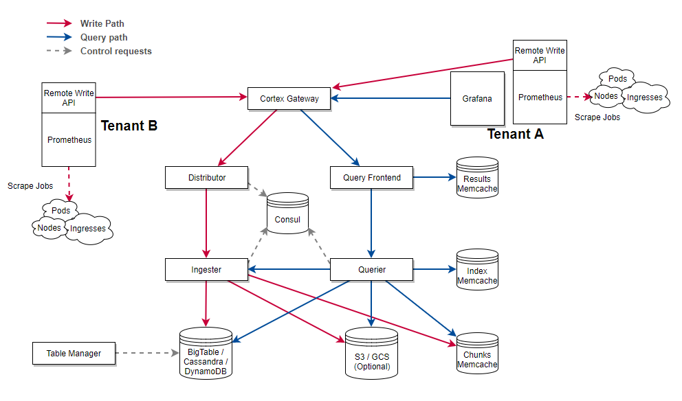

# Archive notice

> **This project is not used internally at REWE-digital anymore and will no longer be maintained.**

# Cortex Gateway

Cortex Gateway is a microservice which strives to help you administrating and operating your [Cortex](https://github.com/cortexproject/cortex) Cluster in multi tenant environments.

## Features

- [x] Authentication of Prometheus & Grafana instances with JSON Web Tokens
- [x] Prometheus & Jager instrumentation, compatible with the rest of the Cortex microservices

#### Authentication Feature

If you run Cortex for multiple tenants you need to identify your tenants every time they send metrics or query them. This is needed to ensure that metrics can be ingested and queried separately from each other. For this purpose the Cortex microservices require you to pass a Header called `X-Scope-OrgID`. Unfortunately the Prometheus Remote write API has no config option to send headers and for Grafana you must provision a datasource to do so. Therefore the Cortex k8s manifests suggest deploying an NGINX server inside of each tenant which acts as reverse proxy. It's sole purpose is proxying the traffic and setting the `X-Scope-OrgID` header for your tenant.

We try to solve this problem by adding a Gateway which can be considered the entry point for all requests towards Cortex (see [Architecture](#architecture)). Prometheus and Grafana can both send a self contained JSON Web Token (JWT) along with each request. This JWT carries a claim which is the tenant's identifier. Once this JWT is validated we'll set the required `X-Scope-OrgID` header and pipe the traffic to the upstream Cortex microservices (distributor / query frontend).

## Architecture

## Configuration

| Flag | Description | Default |
| --- | --- | --- |
| `-gateway.distributor.address` | Upstream HTTP URL for Cortex Distributor | (empty string) |
| `-gateway.query-frontend.address` | Upstream HTTP URL for Cortex Query Frontend | (empty string) |
| `-gateway.auth.jwt-secret` | HMAC secret to sign JSON Web Tokens | (empty string) |

### Expected JWT payload

The expected Bearer token payload can be found here: https://github.com/rewe-digital/cortex-gateway/blob/b74de65d10a93e1ec0d223e92c08d16d59bbf3c4/gateway/tenant.go#L7-L11

- "tenant_id"
- "aud"
- "version" (must be an integer)

The audience and version claim is currently unused, but might be used in the future (e. g. to invalidate tokens).
